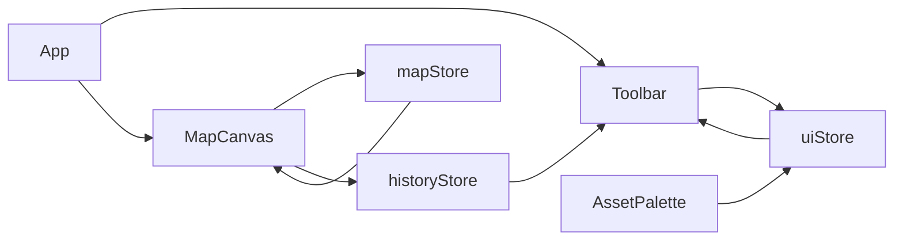

# Hex Map Editor – Implementation Guide  
*Stack: Svelte 5 + Vite + pnpm + Honeycomb + SVG + js-yaml*  

> This guide details installing and integrating Honeycomb for hex grid math and outlines which parts of the app rely on Honeycomb versus custom logic.

---

## 📁 Project Structure

```
/src
├── App.svelte                   # Root layout
├── main.ts                      # Svelte app entry
│
├── components/                  # UI & map-specific tools
│   ├── MapCanvas.svelte         # SVG canvas and tile rendering
│   ├── Toolbar.svelte           # Tool selection, undo/redo, etc.
│   ├── AssetPalette.svelte      # Image picker panel
│   ├── LabelEditor.svelte       # Modal for region label info
│   ├── POIEditor.svelte         # Modal for POI details
│
├── stores/                      # Svelte state stores
│   ├── mapStore.ts              # Tile data, label regions, POIs
│   ├── uiStore.ts               # Selected tool, brush size, asset
│   ├── historyStore.ts          # Undo/redo stacks
│
├── lib/                         # Utilities and helpers
│   ├── hexUtils.ts              # Coordinate math, neighbor fills
│   ├── yamlIO.ts                # YAML import/export
│   ├── assets.ts                # PNG asset listing (via import.meta.glob)
│
├── styles/                      # CSS stylesheets
│   ├── globals.css              # Base resets and themes
│   ├── canvas.css               # SVG styling and tile visuals
│   ├── toolbar.css              # Layout for toolbar and controls

/static
└── hex_png_256x256/             # Asset directory
    ├── Hex Basic Terrain Set/
    ├── Forest/
    ├── River/
    └── Structures/
```

---

## 🛠️ Honeycomb Installation & Integration

1. **Install `honeycomb-grid`:**  
   ```bash
   npm i honeycomb-grid   # citeturn1view0
   yarn add honeycomb-grid   # citeturn1view0
   ```
2. **Import core APIs:**  
   ```js
   import { defineHex, Grid, rectangle, Orientation } from 'honeycomb-grid';   # citeturn1view0
   ```
3. **Define a Hex class:**  
   ```js
   const Hex = defineHex({
     dimensions: 128,               // radius for 256px height  citeturn1view0
     orientation: Orientation.POINTY,  // pointy-top orientation citeturn2search3
     origin: 'topLeft'
   });
   ```
4. **Create a rectangular grid:**  
   ```js
   const grid = new Grid(Hex, rectangle({ width: 10, height: 10 }));   # citeturn1view0
   ```
5. **Core Honeycomb features:**  
   - Rectangle, triangle, hexagon, and parallelogram traversers for various grid shapes citeturn5search5  
   - `grid.pointToHex({ x, y })` for pixel-to-hex conversion citeturn7view0  
   - `hex.getNeighborsInRadius(radius)` for brush-area selections  
   - Serialization support: `JSON.stringify(grid)` and `Grid.from()`  

> **Note:** All rendering, UI event handling, undo/redo logic, and persistence are implemented in the application code, not by Honeycomb.

---

## 📦 Core Features & Responsibilities

| Functionality            | Handled by Honeycomb                | Custom Logic (app code)                |
|--------------------------|-------------------------------------|-----------------------------------------|
| Hex coordinate math      | `Hex`, `Grid`, `pointToHex`, neighbors | Storage in `mapStore.ts`                |
| Grid construction        | `Grid`, shape traversers            | Import/export YAML, localStorage        |
| Serialization            | `grid.toJSON()` / `Grid.fromJSON()` | `yamlIO.ts` and `js-yaml`               |
| Networking / Assets      | —                                   | `assets.ts`, `AssetPalette.svelte`      |
| Rendering                | —                                   | `MapCanvas.svelte` (SVG)                |
| UI & state management    | —                                   | `uiStore.ts`, `historyStore.ts`         |

---

## 🌐 YAML I/O Setup

- Install YAML parser:  
  ```bash
  npm install js-yaml   # citeturn8search0
  ```
- Use `yaml.load()` / `yaml.stringify()` in `yamlIO.ts` for import/export.

---

## 🧮 Key Math & Algorithms

- **Hex distance (axial coords):**  
  ```
  distance(a,b) = max(
    abs(a.q - b.q),
    abs(a.r - b.r),
    abs((-a.q - a.r) - (-b.q - b.r))
  )
  ```  
  Derived from cube coordinates citeturn2search5
- **Brush area:**  
  `hex.getNeighborsInRadius(radius)`
- **Region centroid:**  
  Average of `hex.toPoint()` positions
- **Region outline:**  
  Collect edges without adjacent hex in the same region

---

## 🔄 Component & Store Flow



---

## ✅ Tips & Conventions

- Use `{#each}` with a stable key: `key={\`\${tile.q},\${tile.r}\`}`
- Wrap batch updates in one undo action
- Scope CSS in `styles/*.css`
- Validate all YAML fields before importing (`js-yaml.load`)

---